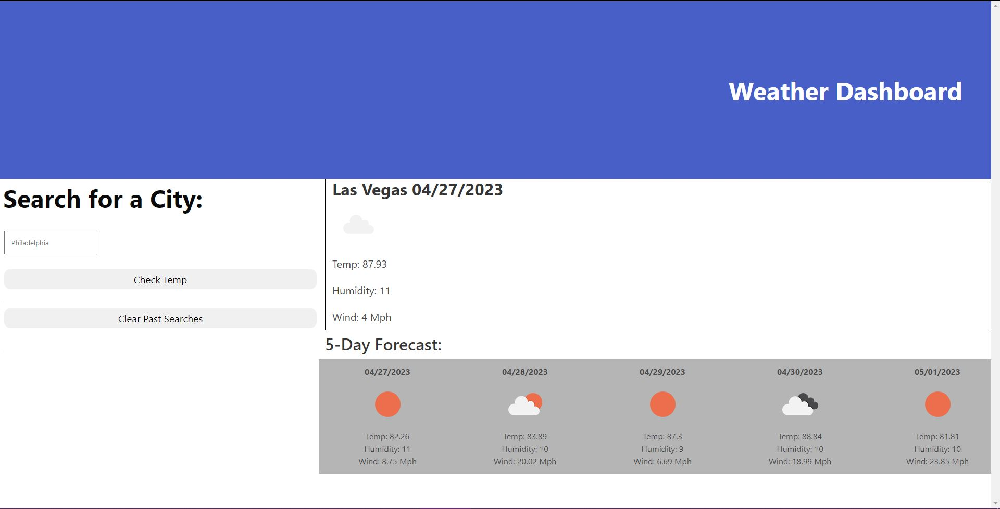

# < Weather-App >

## Description
Continuing my coding journey, I decided to use all the skills I've (tried to) learn thus far and create a functioning weather app. Using JQuery(only DayJS), DOM manipulation, dot notation, and local storage I succeeded in creating an app that can find weather from anywhere in the world, and show it to you for the next six days! Feel free to use this if you're in vital need of some weather information!

## Usage

Type the name of a city into the search bar, and press the button, the results will show around the page! Also a button with your search will show below the bar. That way, you can go back to check the weather if you search for a different city later! If the past searches section gets a bit too long, use the clear button to reset it.

[Live site right here!](https://shadowasders.github.io/Weather-App/)

## Credits

I'd like to thank my instructor [Anthony Maddatu](https://github.com/amaddatu) For really helping me out when I got caught saving the text, without him this would have taken me much longer to figure out!

## License

